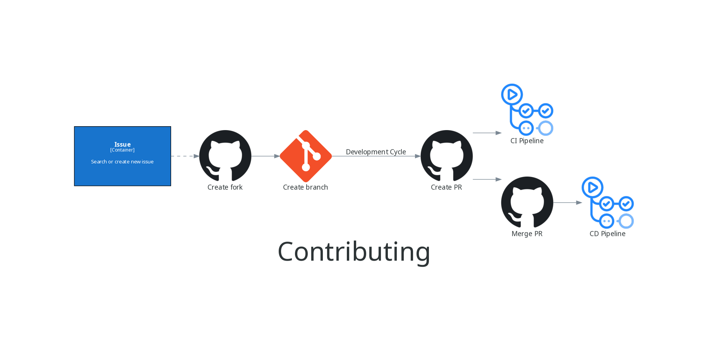
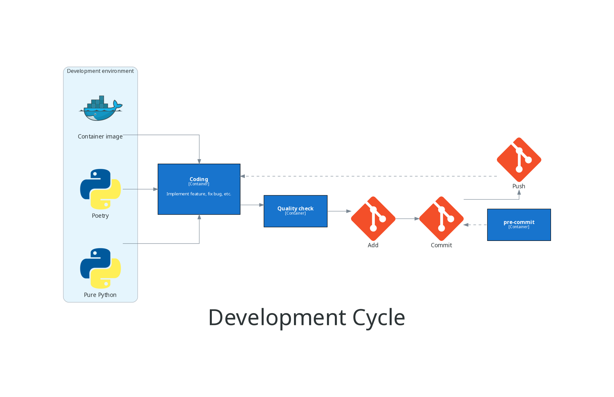

Contributing
============

Here, you can find out how (**and why**) the project is structured to best
understand it and be able to help us improve the project even further.

The following diagram shows the steps for contributing to the project.

The dashed arrow for creating a fork is proposal. Only by creating an issue, you
are already helping this project improve! But if you want to further help and fix
issues yourself, follow the Development Cycle section.

Development Cycle
-----------------

The following diagram shows the steps for contributing to the project.

TALK ABOUT THE PREVIOUS STEPS

1 create fork

2 create branch WITH GOOD NAME (SECTION ABOUT THIS)

3 create PR (link to quality and CI section)

4 maintainers will review and merge the PR (link to versioning and CD section)

AFTER 1 AND 2

choose the development environment you want to use

write/refactor the code to address the issue being worked on

run the quality checks

run git commands

add

commit (at this time, pre-commit will run, if it was set up)

push (if the PR was already open, this will trigger the CI to run again)

BEFORE 3 AND 4

Versioning
----------

The project follows the `Semantic Versioning <https://semver.org/>`_ to assign
and increment the project version. This is enforced through the following:

- **Tests**: the tests in ``tests/test_version.py`` file enforces the correct use of
  Semantic Versioning (which are reproduced) by the CI pipeline of the project.
- **Automation**:

  - **tagging and releasing**: through the ``scripts/versioning.py`` which collects
    the necessary information to the CD pipeline of the project. For this, a
    pull request only changing the project version (and the releases notes, if
    necessary), must be opened and closed.
  - **update of release notes**: through the pull request title, the CD pipeline
    of the project updates the releases notes in the documentation after each
    pull request is closed. It is **very important to write good pull request
    titles** because of this.

  The automation options are mutually exclusive, i.e. only one of them is
  triggered by the CD pipeline at a time.

For the first release, the entire versioning pipeline file,
``.github/workflows/versioning.yml``, must be uncommented during the tagging and
releasing pull request, along with the ``on.push.paths`` both in
``.github/workflows/ci.yml`` and ``.github/workflows/cd.yml`` files, and
``Check version information`` step in ``project-check.steps`` in
``.github/workflows/ci.yml`` file. Also, a Personal Access Token named
**ACTIONS_TOKEN** must be added to Actions secrets, in the repository settings.
